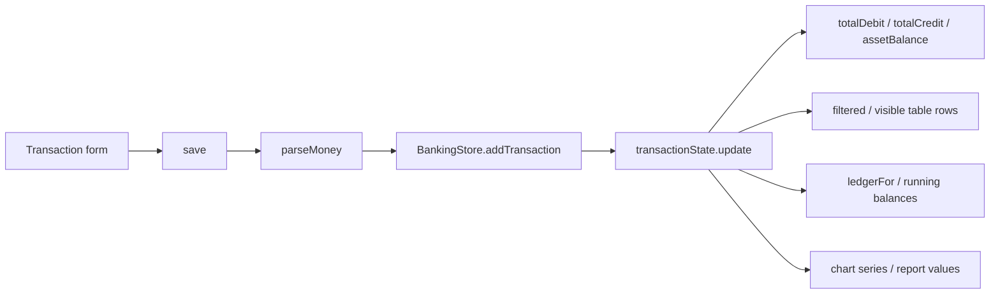

# FinFlow: the complete application flow

This guide follows the actual code: which file runs, which method a button calls, what data changes, and what appears next. Start with the login sequence, then follow one transaction through the store and dashboard.

## 1. What kind of application is this?

FinFlow is an Angular frontend demo. It has **no backend API, database, JWT, real authentication or bank connection**. Services hold sample data in memory. Navigating between pages keeps that data; reloading the browser creates fresh services and resets it.

The demo credentials are `demo@finflow.com` and `FinFlowDemo!`. The signed-in profile is **Demo User**, with initials **DU** and role **Demo administrator**. Both login buttons use this same identity.

The earlier name “Jamie Demo” was hardcoded in the header. It was not fetched from your email or from a server. The header now reads `session.profile()` from [demo-session.service.ts](../src/app/core/demo-session.service.ts), so the displayed name has one source.

## 2. What happens when the application opens?

1. [index.html](../src/index.html) contains `<app-root>`.
2. [main.ts](../src/main.ts) calls `bootstrapApplication(AppComponent, appConfig)`.
3. [app.config.ts](../src/app/app.config.ts) registers the Angular router and client hydration/event replay. Hydration connects Angular to any HTML already rendered by the server.
4. [app.component.html](../src/app/app.component.html) contains the outer `<router-outlet>`. Angular inserts the matched route's component here.
5. [app.routes.ts](../src/app/app.routes.ts) defines all paths and lazy component imports.
6. `/login` loads `LoginComponent`. Visiting `/` or `/dashboard` without an active demo session runs `demoGuard`, which redirects to `/login`.
7. `LoginComponent` constructs its typed `FormGroup` with the demo email, password and `remember` checkbox.
8. Its `afterNextRender()` callback checks whether the demo email was remembered, then sets `ready` to `true`. Until then the sign-in buttons are disabled, so a user cannot submit an uninitialised form during hydration.

This project also has server-side entry points: [main.server.ts](../src/main.server.ts), [server.ts](../src/server.ts) and [app.config.server.ts](../src/app/app.config.server.ts). They render initial HTML when using SSR. The demo session still begins only in the user's browser.

## 3. Exactly what happens when I click Sign In?

| Step | File / method | What happens |
| --- | --- | --- |
| 1 | [login.component.html](../src/app/features/login/login.component.html), `(ngSubmit)="signIn()"` | The submit button, or Enter inside the form, submits the reactive form. |
| 2 | [login.component.ts](../src/app/features/login/login.component.ts), `signIn()` | Marks controls touched and reads `email` and `password` using `getRawValue()`. |
| 3 | `LoginComponent.signIn()` | Checks required/email validators. An invalid form cannot proceed. |
| 4 | [demo-session.service.ts](../src/app/core/demo-session.service.ts), `DemoSession.signIn(email, password)` | Compares the input with `DEMO_CREDENTIALS`. Email comparison trims spaces and ignores case; the password must match exactly. |
| 5a | `DemoSession.signIn()` returns `false` | The component sets `error`. The template shows a `role="alert"` message. There is no navigation. |
| 5b | `DemoSession.signIn()` calls `start()` and returns `true` | `profileState` becomes `DEMO_PROFILE`. The derived `active()` value becomes `true`. |
| 6 | `LoginComponent.openDashboard()` | Passes the checkbox value to `LoginPreferences.remember()`. Only the demo email can be stored; no password or session is persisted. |
| 7 | `router.navigateByUrl('/dashboard')` | Requests the dashboard route. |
| 8 | `demoGuard` in `app.routes.ts` | Reads `DemoSession.active()`. It now returns `true`, allowing navigation. |
| 9 | `ShellComponent` | Renders the sidebar, header and its own nested `<router-outlet>`. |
| 10 | `DashboardComponent` | Renders inside the shell's outlet and reads financial state from `BankingStore`. |

```mermaid
sequenceDiagram
    actor User
    participant Login as LoginComponent
    participant Session as DemoSession
    participant Router as Angular Router / demoGuard
    participant Shell as ShellComponent
    participant Dashboard as DashboardComponent
    participant Store as BankingStore
    User->>Login: Submit Sign In
    Login->>Login: Validate form
    Login->>Session: signIn(email, password)
    alt Credentials match
        Session->>Session: start() sets DEMO_PROFILE
        Session-->>Login: true
        Login->>Router: navigateByUrl('/dashboard')
        Router->>Session: active()
        Session-->>Router: true
        Router->>Shell: Load application shell
        Shell->>Session: Read profile for header
        Router->>Dashboard: Load nested dashboard route
        Dashboard->>Store: Read accounts, transactions and computed totals
    else Invalid credentials
        Session-->>Login: false
        Login-->>User: Show error; stay on login
    end
```

The guard is a demo navigation control, not a security boundary. A real system must validate sessions and permissions on its server.

## 4. What is different about Continue as Demo User?

The button's `(click)` calls `LoginComponent.enterDemo()`. That method calls `DemoSession.start()` directly, then the same `openDashboard()` method used by Sign In.

It skips credential validation because its purpose is portfolio access. It does **not** call an API, create a new account or generate a different user. Both paths end at `/dashboard` with `Demo User / DU / Demo administrator` in the header.

Other login controls:

| Control | Handler | Result |
| --- | --- | --- |
| Eye icon | `visible.set(!visible())` | Switches the password input between `password` and `text`. |
| Remember me | `form.controls.remember` → `LoginPreferences.remember()` on entry | Saves/removes the demo email under `finflow.demo-email` in local storage. It does not keep you signed in. Storage failures do not block access. |
| Forgot password? | `help.set(!help())` | Shows the sample password. There is no password-reset email or network request. |
| Left dashboard preview | `DashboardPreviewComponent` | A visual preview that reads sample totals from `BankingStore`. It is not a second signed-in dashboard. |

## 5. Which route opens which component?

| URL | Component | File | Purpose |
| --- | --- | --- | --- |
| `/login` | `LoginComponent` | [login.component.ts](../src/app/features/login/login.component.ts) | Demo access |
| `/dashboard` | `DashboardComponent` | [dashboard.component.ts](../src/app/features/dashboard/dashboard.component.ts) | Summary, charts, recent entries and quick actions |
| `/accounts` | `AccountsComponent` | [accounts.component.ts](../src/app/features/accounts/accounts.component.ts) | Chart of accounts |
| `/transactions` | `TransactionsComponent` | [transactions.component.ts](../src/app/features/transactions/transactions.component.ts) | Entries and transaction form |
| `/ledger` | `LedgerComponent` | [ledger.component.ts](../src/app/features/ledger/ledger.component.ts) | One account's running balances |
| `/reports` | `ReportsComponent` | [reports.component.ts](../src/app/features/reports/reports.component.ts) | Report configuration, preview and export |
| `/settings` | `SettingsComponent` | [settings.component.ts](../src/app/features/settings/settings.component.ts) | Preferences and sample users |

Everything except `/login` is a child of [ShellComponent](../src/app/layout/shell.component.ts). Clicking a sidebar `routerLink` replaces the child component; it does not rebuild the whole page. `RouterLinkActive` marks the active link. Lazy imports load each feature's code when its route is needed.

## 6. Where do the financial numbers come from?

[demo-data.ts](../src/app/core/demo-data.ts) defines the initial accounts and transactions. [banking.models.ts](../src/app/core/banking.models.ts) defines their shapes and the pure calculation functions.

[banking.store.ts](../src/app/core/banking.store.ts) is `@Injectable({ providedIn: 'root' })`. Angular supplies the same store instance to components in one running application. It contains:

| Store member | Meaning |
| --- | --- |
| `accountState` | Private writable signal containing the account array. |
| `transactionState` | Private writable signal containing the transaction array. |
| `accounts`, `transactions` | Readonly signal views for components. Call them as `accounts()` and `transactions()` to read their current values. |
| `totalDebit` | Computed sum of all debit amounts, in cents. |
| `totalCredit` | Computed sum of all credit amounts, in cents. |
| `assetBalance` | Computed sum of current balances for asset accounts only. |
| `accountName(id)` | Looks up the readable name for an account ID. |
| `balance(account)` | Gets its last running ledger balance, or its opening balance if there are no entries. |
| `addAccount(input)` | Validates, assigns an ID, and replaces the account array with a new array containing the new account. |
| `addTransaction(input)` | Validates, assigns a reference, and replaces the transaction array with a new array containing the entry. |
| `reset()` | Restores both arrays to the sample data. |

### What does `computed()` mean in your selected file?

```ts
readonly totalDebit = computed(() => this.total('Debit'));
```

`totalDebit` is a **derived signal**. It gets its value from other signals; you do not manually assign a total after every transaction. `total('Debit')` reads `transactions()`, so Angular tracks that dependency even though the read happens inside a helper method.

When `transactionState.update(...)` replaces the transaction array, Angular invalidates the cached computed value. On the next read, it calculates the new total. A template reading `store.totalDebit()` is notified that it may need updating. `OnPush` components still update because Angular tracks the signals their templates read.

`computed()` does not call a server, save data or continuously poll. It is suitable for a value derived from state. A normal method such as `balance(account)` recalculates when called; it is not itself a cached computed signal.

## 7. Account creation, step by step

1. Click **New account** on `/accounts`: the template calls `AccountsComponent.open()`.
2. `open()` clears the form and error state, then calls `ModalComponent.open()`.
3. [ModalComponent](../src/app/shared/modal.component.ts) calls the native dialog's `showModal()`. The browser handles modal focus; Escape dismisses it.
4. Fill in the fields and click **Create account**. `(ngSubmit)` calls `AccountsComponent.save()`.
5. `save()` reads the form and calls `parseMoney(opening)` to convert text such as `"100.00"` into `10000` cents.
6. The component checks its validators, then calls `BankingStore.addAccount(...)`.
7. The store rejects duplicate names, invalid account types or invalid opening balances. Otherwise it assigns the next numeric ID and updates `accountState`.
8. On success, the component clears filters, closes the modal and sets a success message. On failure, it catches the error and shows it inside the dialog.
9. `filtered()` recalculates and the account table updates. Dashboard account counts and distribution also update when read.

The dashboard's **Create account** quick action navigates to `/accounts?create=true`. `AccountsComponent` checks that query parameter in `afterNextRender()` and opens the same modal automatically.

## 8. Transaction entry and automatic updates

1. **New transaction** calls `TransactionsComponent.open()`, which resets the form and opens its modal.
2. **Record transaction** submits the form and calls `TransactionsComponent.save()`.
3. `save()` reads the form and calls `parseMoney(amount)`. For example, `"0.29"` becomes exactly `29` cents.
4. Invalid fields, zero amounts or more than two decimal places produce an error. Valid input goes to `BankingStore.addTransaction(...)`.
5. The store verifies the account exists, the calendar date is real, the entry type is supported, and the amount is a positive safe integer.
6. It creates the next reference, such as `TX-009`, trims the description and updates the transaction signal with a new array.
7. The component clears its filters, returns to page 1, closes the modal and shows a success message. Entries are sorted by date/reference, so a backdated entry may appear on a later page.
8. `filtered()`, `pages()` and `visible()` derive the table's matching rows and pagination.
9. Dashboard totals, recent transactions, September chart series and any dependent report/ledger values are invalidated and recomputed when read.



The dashboard's **New transaction** quick action uses `/transactions?create=true`. The query parameter opens the same transaction modal after the destination view renders.

## 9. How the ledger calculates balances

Clicking an account's **View ledger** link opens `/ledger?account=ACCOUNT_ID`. `LedgerComponent.accountId` starts from that query parameter, or defaults to account `1001`.

`account()` resolves the selected account. `allEntries()` calls `ledgerFor(account, transactions)`:

1. Filter entries belonging to that account.
2. Sort by date, then reference.
3. Begin with `openingBalanceCents`.
4. Call `balanceChange(account, entry)` for every row.
5. Return each transaction with its new `balanceCents`.

| Account type | Debit | Credit |
| --- | --- | --- |
| Asset or Expense | Increases balance | Decreases balance |
| Liability or Income | Decreases balance | Increases balance |

The component's `entries()` applies the date filter **after** running balances are calculated. `opening()` includes entries before the selected start date; `closing()` uses the last included entry or the carried-forward opening balance. This prevents the ledger from pretending a filtered period starts from zero.

Example: an asset account opens at `10000` cents (€100.00). A debit of `29` cents makes its balance `10029` cents (€100.29).

`MoneyPipe` converts cents for display. `CalendarDatePipe` formats date-only values without shifting the day across timezones.

## 10. Dashboard chart and summary flow

- `DashboardComponent.recent()` sorts transactions newest first and takes five rows.
- `AccountDistributionComponent.types()` counts accounts by type. Its `distribution()` turns those counts into the doughnut chart's CSS gradient.
- [TrendComponent](../src/app/shared/trend.component.ts) groups September 2026 entries into weekly debit and credit totals. `series()` derives the values; the point calculations scale them for the SVG. Transactions outside that month still affect all-time totals but not this fixed-period chart.
- **View chart data** opens the same weekly values as a table. It provides a text alternative to the graph.
- Quick actions use `routerLink` and optional query parameters. They do not duplicate the forms or calculation logic.

## 11. Report generation and download flow

1. A report card calls `ReportsComponent.open(kind)`.
2. That method prepares `draftKind`, `draftFrom` and `draftTo`, then opens the configuration modal.
3. A reversed date range sets `invalidRange()` and disables generation.
4. **Generate report** calls `generate()`, which copies the draft into `selected`, `from` and `to`, sets `generated`, and closes the modal.
5. **Cancel** closes the dialog without replacing an existing generated report. Separate draft state prevents this accidental change.
6. The preview reads either account balances, `periodEntries()`, or the `income()`/`expense()` computations.
7. **Export CSV** calls `ReportsComponent.export()` → [ExportService.download()](../src/app/core/export.service.ts) → `toCsv(rows)`.
8. CSV fields are quoted, embedded quotes are escaped and text formula prefixes are neutralised. A temporary Blob URL starts the download and is then revoked.
9. **Print / PDF** calls `ExportService.print()`, opening the browser print dialog. There is no server-side PDF generator.

`LedgerComponent.export()` uses the same export service for a selected account and period. Reports are live views of current in-memory data, not immutable financial documents.

## 12. Settings and sample users

`SettingsComponent` uses [SettingsStore](../src/app/core/settings.store.ts) for preferences and users:

| User action | Component method | Store call and result |
| --- | --- | --- |
| Save preferences | `savePreferences()` | `settings.savePreferences(workspace, digest)` updates the session's workspace name and digest preference. The header reads `settings.workspace()` and updates. |
| Add user | `open()` then `addUser()` | Validates the form, checks duplicate email addresses, calls `settings.addUser(value)` and closes the modal. |
| Activate / Deactivate | `toggle(id)` | `settings.toggleUser(id)` replaces the matching user's status. |
| Reset demo data | `reset()` after confirmation | `BankingStore.reset()` restores accounts and transactions. This does not reset the team list or workspace preferences. |

Sample team users are **not login accounts**. Adding one does not change `DEMO_CREDENTIALS`, the current header identity or permissions. Digest preferences send no emails.

## 13. Ending the session or reloading

**End demo session** calls `ShellComponent.signOut()`:

1. `DemoSession.end()` clears the current profile; `active()` becomes false.
2. `BankingStore.reset()` restores sample financial data.
3. `SettingsStore.reset()` restores sample users and workspace preferences.
4. `router.navigateByUrl('/login')` returns to login.

A browser reload also recreates all in-memory services and returns protected routes to login. The only optional persisted value is the demo email from **Remember me**. No account, transaction, password or signed-in session is saved in local storage.

## 14. Where to set breakpoints while learning

Follow these in order using the browser debugger or your IDE:

1. `LoginComponent.signIn()` — inspect `form.getRawValue()`.
2. `DemoSession.signIn()` and `start()` — watch the profile become `DEMO_PROFILE`.
3. `demoGuard` — see `active()` return true.
4. `TransactionsComponent.save()` — inspect the string amount before parsing.
5. `parseMoney()` — see the conversion into integer cents.
6. `BankingStore.addTransaction()` — inspect the new entry and `transactionState.update()`.
7. `BankingStore.total()` — see a computed total recalculate when read after the update.
8. `ledgerFor()` and `balanceChange()` — step through running balances.

The `.spec.ts` files test these domain rules. [e2e/banking.spec.ts](../e2e/banking.spec.ts) follows actual browser interactions, including account creation, transaction reconciliation, report cancellation/export, session preferences and desktop viewport fitting.

## 15. Layout and artwork

[login.component.scss](../src/app/features/login/login.component.scss) uses a viewport-height desktop layout with a flexible preview area. [dashboard.component.scss](../src/app/features/dashboard/dashboard.component.scss) fits the summary, chart, distribution, five recent entries and quick actions into a desktop grid. Smaller or unusually short viewports keep natural scrolling so content remains reachable rather than being clipped.

The background is [public/images/login-architecture.png](../public/images/login-architecture.png), generated with the built-in image generation tool. The prompt requested a dark navy/teal banking-login background, a glass office tower at the far right, negative space for live text, thin turquoise waves, and no text, logos or UI. All interface text, controls, icons, preview values and charts are rendered by the application.
